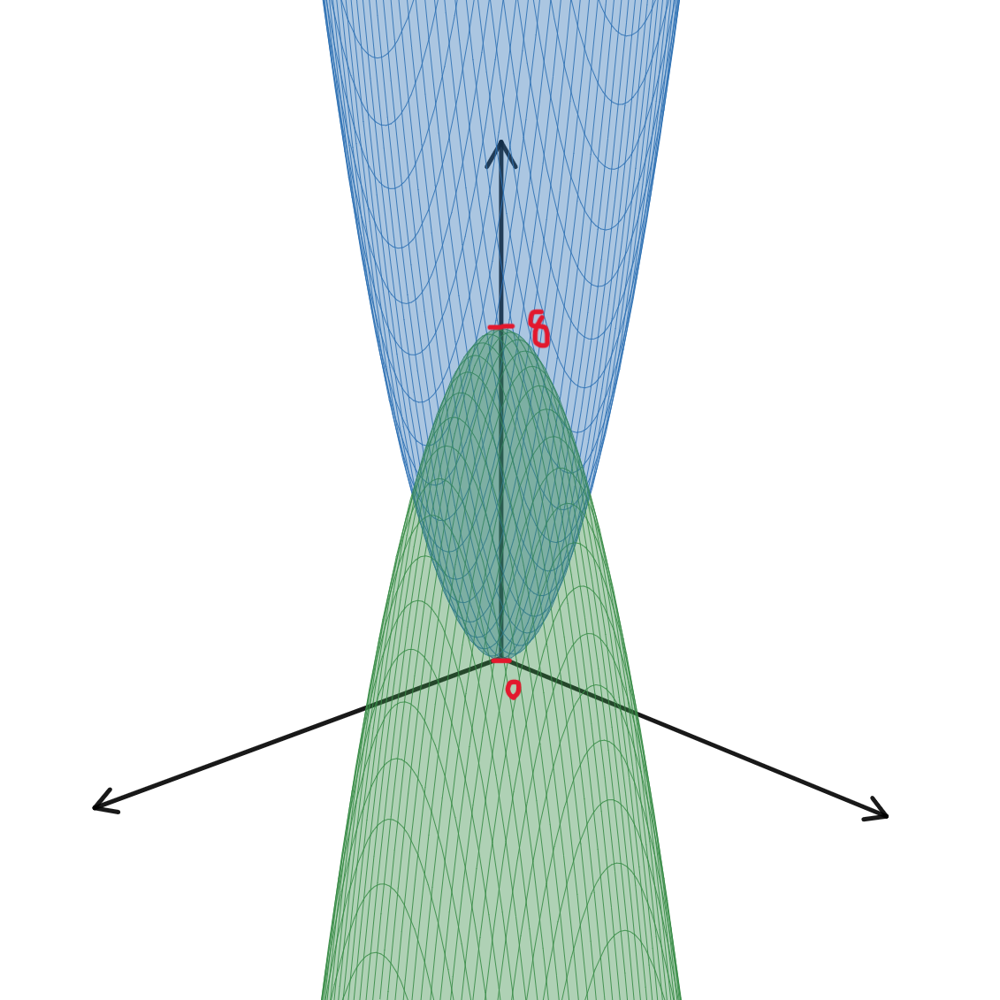

# HW6

## 15.7-28

$$
r^2=ra\cos\theta \Rightarrow x^2+y^2=ax \Rightarrow (x-\frac{a}{2})^2+y^2=\frac{a^2}{4}
$$

$$
\begin{array}{rlr}
& \int_{-\frac{\pi}{2}}^{\frac{\pi}{2}}\int_{0}^{a\cos\theta}\int_{-\sqrt{a^2-r^2}}^{\sqrt{a^2-r^2}}r\,dz\,dr\,d\theta & \\
&&\\
= & \int_{-\frac{\pi}{2}}^{\frac{\pi}{2}}\int_{0}^{a\cos\theta}2r\sqrt{a^2-r^2}\,dr\,d\theta & \\
&&\\
= & -\int_{-\frac{\pi}{2}}^{\frac{\pi}{2}}\int_{a^2}^{a^2\sin^2\theta}\sqrt{u}\,du\,d\theta & u = a^2-r^2,\,du = -2r\,dr\\
&&\\
= & \frac{2}{3}\int_{-\frac{\pi}{2}}^{\frac{\pi}{2}}a^3-a^3|\sin^3\theta|\,d\theta & \\
&&\\
= & \frac{2}{3}\int_{-\frac{\pi}{2}}^{\frac{\pi}{2}}a^3\,d\theta-\frac{2}{3}\int_{-\frac{\pi}{2}}^{\frac{\pi}{2}}a^3|\sin^3\theta|\,d\theta & \\
&&\\
= & \frac{2}{3}\pi a^3-\frac{2}{3}\times2 \int_{0}^{\frac{\pi}{2}}a^3\sin^3\theta\,d\theta & \\
&&\\
= & \frac{2}{3}\pi a^3-\frac{4a^3}{3}\int_{0}^{\frac{\pi}{2}}(1-\cos^2\theta)\sin\theta\,d\theta & \\
&&\\
= & \frac{2}{3}\pi a^3+\frac{4a^3}{3}\int_{1}^{0}(1-t^2)\,dt & t=\cos\theta,\,dt=-\sin\theta\,d\theta\\
&&\\
= & \frac{2}{3}\pi a^3-\frac{4a^3}{3}(1-\frac{1}{3}) & \\
&&\\
= & \frac{2}{3}\pi a^3-\frac{8}{9}a^3= \frac{2}{9}a^3(3\pi-4)_\#&\\
\end{array}
$$

## 非批改題目解答

### 15.5

$$ (6)\,\,\,9-5\frac{\sqrt{5}}{3}\,\,\,\,\,\,(13)\,\,\,a^2(\pi-2)\,\,\,\,\,\,(26)\,\,\,16 $$

### 15.6

$$ (11)\,\,\,\int_{0}^{2}\int_{0}^{x^2}\int_{0}^{2-x}x+y\,dz\,dy\,dx,\,\frac{8}{3}\,\,\,\,\,\,(26)\,\,\,20\pi\,\,\,\,\,\,(38)\,\,\,-\,\,\,\,\,\,(58)\,\,\,\frac{3}{8} $$

### 15.7

$$(11)$$

$$(16)\,\,\,\int_{0}^{2\pi}\int_{0}^{2}\int_{r}^{6-r^2}r^2\sin\theta\cos\theta\,dz\,dr\,d\theta,\,0\,\,\,\,\,\,(22)\,\,\,-\frac{255}{4}\pi $$

## 15.6-38

1. $\int_{0}^{1}\int_{0}^{\sqrt{1-z}}\int_{0}^{1-x}f\,dy\,dx\,dz$
2. $\int_{0}^{1}\int_{0}^{1-x}\int_{0}^{1-x^2}f\,dz\,dy\,dx$
3. $\int_{0}^{1}\int_{0}^{1-y}\int_{0}^{1-x^2}f\,dz\,dx\,dy$
4. $\int_{0}^{1}\int_{0}^{1-\sqrt{1-z}}\int_{0}^{\sqrt{1-z}}f\,dx\,dy\,dz$+$\int_{0}^{1}\int_{1-\sqrt{1-z}}^{1}\int_{0}^{1-y}f\,dx\,dy\,dz$
5. $\int_{0}^{1}\int_{0}^{2y-y^2}\int_{0}^{1-y}f\,dx\,dz\,dy$+$\int_{0}^{1}\int_{2y-y^2}^{1}\int_{0}^{\sqrt{1-z}}f\,dx\,dz\,dy$